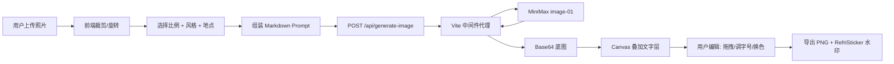

<div align="center">

# 🧊 RefriSticker

**把旅行照片变成可下载的冰箱贴**

[](https://react.dev)
[](https://vitejs.dev)
[](https://api.minimaxi.com)
[](LICENSE)
[](https://github.com/aIeXCai/RefriSticker/stargazers)
[](https://github.com/aIeXCai/RefriSticker/commits/main)

> 上传照片 · 选择风格 · 记录地点 · 下载你的专属冰箱贴设计

[快速开始](#-快速开始) · [特性](#-核心特性) · [架构](#-架构) · [提示词工程](#-提示词工程) · [路线图](#-路线图)

</div>

---

## 这是什么

**RefriSticker** 是一个面向旅行者、摄影玩家和文创爱好者的 Web 应用。它把你手机里的旅行照片,经过三种艺术风格的转绘(清新插画 / 国风水墨 / 漫画赛璐璐),变成一张可二次编辑、可下载的冰箱贴设计稿。

不是给照片加滤镜,而是重新画一张。文字、版式、边框、日期都由前端排版,确保永远不出现 AI 乱码。

> 目标用户:在京都街头拍了 200 张照片、走时买了 7 个冰箱贴、回来后还想做点什么的你。

---

## ✨ 核心特性

| | |
|---|---|
| 🎨 **三种独立风格** | 清新复古海报插画 / 国风工笔 / 漫画赛璐璐,视觉差异显著,不是同一渲染的微调 |
| 📐 **三种画幅比例** | 4:5 竖版 · 1:1 方形 · 4:3 横版,适配不同分享场景 |
| ✏️ **Canvas 文字编辑器** | 地点、英文地点、日期、旅行短句四层独立编辑,支持拖拽、调字号、改色、对齐 |
| 🔒 **服务端代理** | MiniMax API Key 只存在于服务端环境变量,浏览器永远不接触密钥 |
| 📝 **版本化提示词** | Prompt 以 Markdown 形式存放在 `app/prompts/`,Vite 热更新,按 `base + style + composition + negative` 拼装 |
| 🪄 **智能失败处理** | 余额不足 / 内容安全拒绝 / 超时 / Key 失效,均有可读的中文提示和重试入口 |
| 📱 **移动端优先** | 上传、裁剪、编辑、下载在手机端同样顺畅 |

---

## 🎨 视觉语言

### 三种风格一眼可辨

| **ILLUSTRATION** · 复古海报插画 | **CHINESE** · 工笔国风 | **COMIC** · 漫画赛璐璐 |
| :---: | :---: | :---: |
|  |  |  |
| 简化色块 · 6–8 种主色<br>丝网印刷质感 · 纸张颗粒<br>**现代文创感** | 工笔墨线 · 矿物色/青绿/赭石<br>宣纸肌理 · 留白克制<br>**现代博物馆文创感** | 硬边描线 · 平涂<br>赛璐璐阴影 · 适度夸张<br>**单幅海报感** |

> 三种风格使用同一张基础旅行照片做参考,转绘时**保留原场景的结构**(建筑、人物、视角),只重写艺术语言。

### 品牌配色

| 用途 | 颜色 | Hex |
|---|---|---|
| 主品牌色 | 湖水薄荷绿 | `#69C7B8` |
| 主按钮深色 | 松石绿 | `#239A8A` |
| 辅助色 | 晴空蓝 | `#8BC9EA` |
| 暖色点缀 | 杏桃橙 | `#FFB77D` |
| 卡片背景 | 暖白 | `#FFFDF8` |
| 页面背景 | 云朵白 | `#F8FBF7` |
| 文本主色 | 深青灰 | `#243B3A` |

---

## 🏗️ 架构

### 核心原则

> **模型只画无文字的底图。所有文字、版式、边框、水印由前端叠加。**

这条原则贯穿整个项目:它保证永远不会出现 AI 生成的乱码,保证所有作品版式一致,保证文字始终可编辑。

### 端到端流程



### 模块边界

```
┌────────────────────────────────────────────────────────┐
│  浏览器 (React 19 + Vite 6)                            │
│  ┌──────────┐  ┌──────────┐  ┌──────────┐  ┌─────────┐ │
│  │ 上传裁剪 │→ │ 风格选择 │→ │ 文字编辑 │→ │ Canvas │ │
│  └──────────┘  └──────────┘  └──────────┘  │ 导出   │ │
│                                            └─────────┘ │
│  • 状态全在内存,无后端持久化                            │
│  • 调用 /api/generate-image,不接触 API Key            │
└────────────────────────────────────────────────────────┘
                          │ HTTP POST (含 prompt + base64 照片)
                          ▼
┌────────────────────────────────────────────────────────┐
│  Vite Middleware (开发/预览同进程)                      │
│  • 校验 prompt 长度(≤ 1500)                            │
│  • 校验尺寸白名单(1024×1280/1024×1024/1152×864)       │
│  • 校验参考图 MIME                                     │
│  • 读取 MINIMAX_API_KEY                                 │
│  • 转发到 MiniMax,转换错误码为中文提示                  │
└────────────────────────────────────────────────────────┘
                          │ HTTPS Bearer
                          ▼
┌────────────────────────────────────────────────────────┐
│  MiniMax image_generation API                          │
│  • model: image-01                                     │
│  • subject_reference: [{ type: "character", ... }]    │
│  • response_format: base64                             │
│  • prompt_optimizer: false(走我们自己的 prompt)        │
│  • aigc_watermark: false(水印我们自己加)              │
└────────────────────────────────────────────────────────┘
```

---

## 🚀 快速开始

### 前置条件

- **Node.js** ≥ 20
- 一个 **MiniMax** 开放平台账号(注册 → 创建 API Key → 充值)

### 1. 克隆并安装

```bash
git clone https://github.com/aIeXCai/RefriSticker.git
cd RefriSticker/app
npm install
```

### 2. 配置 API Key

```bash
cp .env.example .env.local
```

编辑 `app/.env.local`,把 `MINIMAX_API_KEY` 替换成你自己的:

```env
# MiniMax 开放平台 → API Keys → 创建
MINIMAX_API_KEY=eyJhbGciOiJIUzI1NiIsInR5cCI6IkpXVCJ9...
```

### 3. 启动开发服务

```bash
npm run dev
```

打开 [http://127.0.0.1:5173](http://127.0.0.1:5173) 即可使用。

### 4. 生产构建

```bash
npm run build      # 产物在 app/dist/
npm run preview    # 本地预览生产构建
```

> ⚠️ **改完 `.env.local` 必须重启服务**,Vite 只在启动时加载环境变量。

---

## ⚙️ 配置详解

### 环境变量

| 变量 | 必填 | 说明 |
|---|---|---|
| `MINIMAX_API_KEY` | ✅ | MiniMax 开放平台密钥。缺失时 `/api/generate-image` 返回 503 |

### 三种生成尺寸

| 比例 | 用途 | 像素 |
|---|---|---|
| 4:5 竖版 | 移动端分享、冰箱贴实物 | 1024 × 1280 |
| 1:1 方形 | 头像贴纸、社交方图 | 1024 × 1024 |
| 4:3 横版 | 横版横幅、桌面壁纸 | 1152 × 864 |

### MiniMax 错误码 → 中文提示

| 状态码 | 含义 | 提示 |
|---|---|---|
| 1002 | 请求过频 | 请稍后再试 |
| 1004 / 2049 | Key 无效 | 检查 `MINIMAX_API_KEY` 是否正确 |
| 1008 | 余额不足 | 前往 MiniMax 充值 |
| 1026 | 内容安全拒绝 | 检查照片和输入文本 |
| 2013 | 参数错误 | 检查 prompt 与尺寸 |
| 超时 | 120s 未返回 | 重试 |

---

## 🧠 提示词工程

这是项目最有意思的部分。**Prompt 不直接由用户输入**,而是按章节从 Markdown 中拼装:

```text
最终 Prompt = base  +  style.<风格>  +  composition.<比例>  +  negative
```

### 文件结构

```
app/prompts/
└── refri-sticker-v1.md
    ├── base
    ├── style.illustration
    ├── style.chinese
    ├── style.comic
    ├── composition.portrait      (4:5 竖版)
    ├── composition.square        (1:1 方形)
    ├── composition.landscape     (4:3 横版)
    └── negative
```

### 各章节职责

| 章节 | 作用 |
|---|---|
| `base` | 强制要求保留原照片结构(视角、人物、建筑、关系),只重写艺术语言;禁止输出文字、样机、3D |
| `style.*` | 定义每种风格的艺术语言关键词(色块、墨线、留白、赛璐璐等) |
| `composition.*` | 告知模型当前画幅比例的构图策略(竖版/方形/横版各不同) |
| `negative` | 兜底禁止项,防止模型在边缘情况输出文字或乱码 |

### 为什么这样设计

- **可热更新**: 编辑 Markdown,Vite 自动热更新,不用改代码、不用重启
- **可版本化**: `promptVersion: "v1"` 记录在生成历史中,方便回溯
- **可对照实验**: 每改一个章节,只影响一个变量,A/B 测试清晰
- **可复用**: 同套提示词可复用到未来其他产品(明信片、笔记本封面等)

### 调试建议

1. 准备 10 张固定测试图(街景 3 / 风景 2 / 建筑 2 / 人物 2 / 夜景 1)
2. 每种风格至少跑两轮
3. 评估维度:地点保真、人物保真、风格强度、无乱码、画面完成度
4. 每次只改一个章节
5. 目标:每种风格 ≥ 80% 可接受率

---

## 📁 项目结构

```
RefriSticker/
├── app/                          # React 应用
│   ├── src/
│   │   ├── App.jsx               # 主应用(565 行,单文件包含全部流程)
│   │   ├── main.jsx              # 入口
│   │   ├── prompt-builder.js     # 从 Markdown 解析并组装 prompt
│   │   ├── styles.css            # 全部样式
│   │   └── assets/               # 内置示例图与风格预览
│   ├── prompts/
│   │   └── refri-sticker-v1.md   # ⭐ 版本化提示词源
│   ├── public/
│   │   └── assets/               # 静态资源
│   ├── vite.config.mjs           # ⭐ 内含 /api/generate-image 中间件
│   ├── package.json
│   ├── AGENTS.md                 # 设计与实现约束
│   ├── MINIMAX.md                # MiniMax 接入文档
│   └── .env.example
├── docs/
│   ├── RefriSticker-PRD-v0.2.md  # 产品需求文档
│   └── HANDOFF.md                # 交接文档
└── reference_images/             # 视觉风格参考与素材
    ├── 插画-风格参考.png
    ├── 国风-风格参考.png
    ├── 漫画-风格参考.png
    └── douyin/                   # 调研截图
```

---

## 🛠️ 技术栈

| 层 | 选型 | 版本 |
|---|---|---|
| 框架 | React | 19.2 |
| 构建 | Vite | 6.4 |
| 路由 | — (单页流程,无需路由) | — |
| 图标 | react-icons | ^5.6 |
| 图像生成 | MiniMax image-01 | image-01 |
| 图像合成 | Canvas 2D API | 浏览器原生 |
| 服务端代理 | Vite Middleware (开发) / 同形态部署到 Serverless | — |
| 状态管理 | React `useState` / `useReducer` | 内存态 |
| 持久化 | 浏览器内存(刷新即丢) | — |

> MVP 阶段刻意不引入路由、状态管理库、UI 组件库——保持单文件、零依赖、易于理解和改造。

---

## 🎯 关键设计决策

| 决策 | 理由 |
|---|---|
| **文字由前端叠加,不交给模型** | 避免 AI 乱码;保证版式一致;文字始终可编辑 |
| **API Key 走服务端代理** | 浏览器请求会暴露密钥,即使在生产环境也要走服务端 |
| **三风格统一用同一张照片做参考** | 让风格对比有意义,不是三张无关的图 |
| **三种固定模板,不允许自由变形** | MVP 阶段冻结设计变量,降低测试成本 |
| **用户作品只用常规矩形轮廓** | 异形/手撕轮廓只属于首页静态展示,不做为生成选项 |
| **无登录、无后端数据库** | MVP 验证核心假设,先把生成-编辑-下载闭环跑通 |
| **下载固定带 RefriSticker 水印** | 为未来付费高清下载留出升级空间 |
| **Prompt 用 Markdown 而非 JS 字符串** | 提示词工程师无需懂代码;热更新;支持版本化 |

---

## ✅ 已实现(MVP 范围)

- [x] 首页与产品案例展示
- [x] 上传 JPG / PNG / WEBP,支持拖拽和移动端相册
- [x] 手动裁剪、缩放、旋转
- [x] 必填地点 + 可选英文地点 / 日期 / 旅行短句
- [x] 三种风格:illustration / chinese / comic
- [x] 三种比例:4:5 / 1:1 / 4:3
- [x] AI 生成无文字底图
- [x] Canvas 文字编辑器:四层独立编辑、拖拽、字号、颜色、对齐
- [x] 撤销 / 重做(最近 20 步)
- [x] 一键水平居中
- [x] 快速位置:顶部、画面内底部、留白区居中
- [x] 分阶段进度文案
- [x] 失败时中文错误提示与原参数重试
- [x] 下载 PNG,带 RefriSticker 水印
- [x] API Key 服务端代理,完全不在前端暴露

---

## 🗺️ 路线图

### v0.3 — 数字资产化
- [ ] 用户登录与历史作品库
- [ ] 浏览器内自动保存(IndexedDB),刷新不丢
- [ ] 更多可选文字层:经纬度、天气、行程编号
- [ ] 高清无水印付费下载
- [ ] 分享链接与社交平台尺寸适配

### v0.4 — 实体落地
- [ ] 实体冰箱贴下单与物流
- [ ] 多张照片旅行套装(同地点多角度)
- [ ] 自动地点识别(地标反向地理编码)
- [ ] 地图元素叠加(细线轮廓、坐标点)

### v1.0 — 创作者生态
- [ ] 创作者会员与商用授权
- [ ] 批量生成 API
- [ ] 景区 / 民宿 / 旅行社品牌定制页
- [ ] 供应链与订单履约系统

---

## 🐛 故障排除

### 服务启动后访问首页 502 / 503

```bash
# 检查 .env.local 是否存在且未注释
cat app/.env.local
# 应该看到一行: MINIMAX_API_KEY=eyJ...
# 不存在则: cp app/.env.example app/.env.local 后填入
```

### 提示 "MINIMAX_API_KEY 鉴权失败" (1004 / 2049)

- 确认 Key 在 [MiniMax 控制台](https://api.minimaxi.com)处于启用状态
- 确认账户已开通 image-01 模型权限
- 改完 `.env.local` 一定要**重启** `npm run dev`

### 提示 "余额不足" (1008)

- 前往 [MiniMax 计费页](https://api.minimaxi.com)充值

### 风景照生成结构保持不理想

- MiniMax 当前正式支持的主体参考类型是 `character`
- 单人正面照片效果最稳定
- 风景照可以提交,但场景结构保持能力不在官方承诺范围

### 修改了 prompt 模板但没生效

- `app/prompts/refri-sticker-v1.md` 在 Vite 启动时按 `?raw` 加载
- 修改后保存即可,Vite HMR 会自动重载
- 如果还没生效,确认章节标题是 `## section_name` 格式(且用 `##` 而不是 `###`)

### 浏览器报 "Mixed Content" 或 "CORS"

- 一切走 `http://127.0.0.1:5173`,不要改成 `0.0.0.0` 或公网 IP
- 生产部署时确保 `/api/generate-image` 与前端同源

---

## 🤝 贡献

欢迎 PR、Issue、风格建议、提示词优化。提交前请:

1. 读 `app/AGENTS.md` 和 `app/MINIMAX.md` 了解设计与接入约束
2. 修改 prompt 时同步更新 `promptVersion` 字段(见 `app/src/prompt-builder.js:3`)
3. 跑过三种风格各 3 张图再提 PR,附生成结果对比

---

## 📜 License

[MIT](LICENSE) © 2026 RefriSticker Contributors

---

## 🙏 致谢

- [MiniMax](https://api.minimaxi.com) 提供 `image-01` 图生图能力
- [React](https://react.dev) + [Vite](https://vitejs.dev) 提供现代前端体验
- 所有提供参考图、测试照和反馈的早期用户

---

<div align="center">

**🧊 把旅行照片变成可下载的冰箱贴**

如果这个项目帮到了你,欢迎点 ⭐ 和分享

</div>
